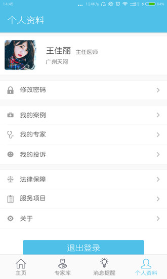
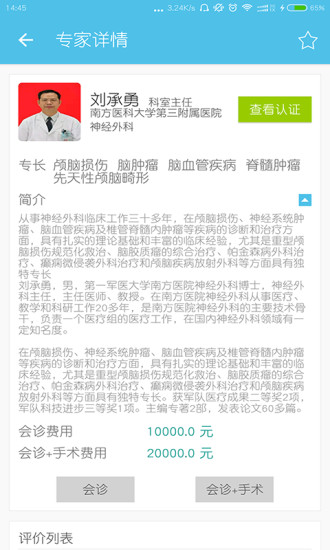

# 高手在线

## 简介
高手在线APP是一款关于解决基层医疗机构医生与大城市三甲医院专家实时沟通的移动交流平台。众所周知，目前当基层医院医生碰到危、急、重症的病人时，需要请上级医院专家来会诊的时候，主要是通过熟人找关系，通过电话联络实现的。这种交流方式存在问题是不及时、不专业、不便捷等诸多问题。。找专家会诊，找专家手术，寻找您心中的医疗高手，高手在线APP来帮忙您。

该应用为双码科技公司开发，并已上线应用宝，应用链接：[点我](https://sj.qq.com/myapp/detail.htm?apkName=com.gaoshou.android)

## 应用截图

> 有需要完整代码或其他开发需求，请联系QQ：275753675
